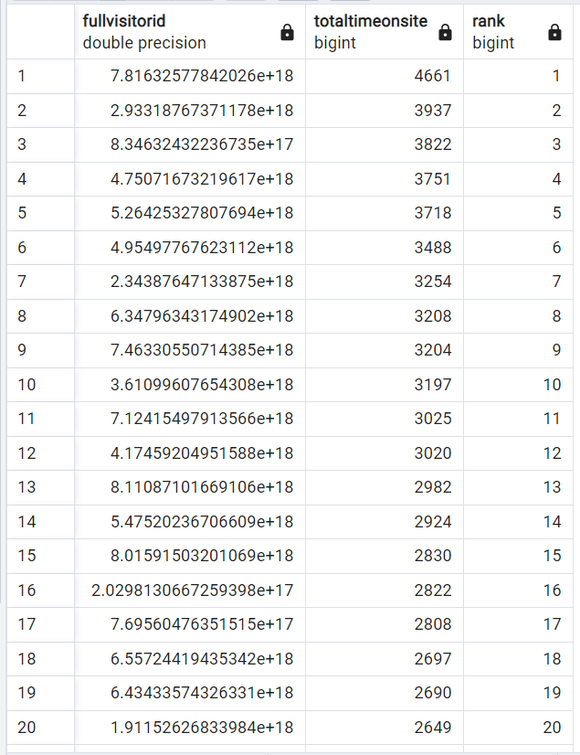
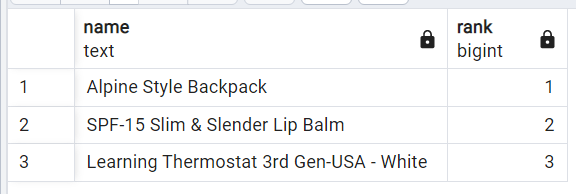
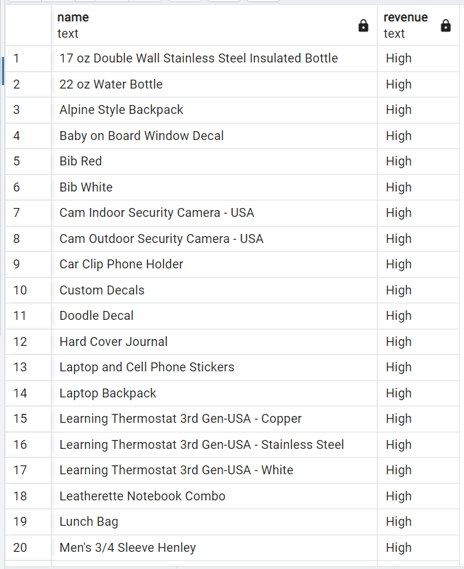
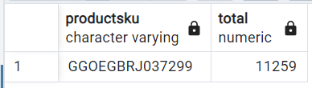

Question 1: Rank visitors based on their time spent on the site.

SQL Queries:
```SQL
-- Displays fullvisitorid, totaltimeonsite, and rank based on totaltimeonsite
SELECT fullvisitorid, 
	   SUM(timeonsite) AS totaltimeonsite,
	   RANK() OVER(
	   		ORDER BY SUM(timeonsite) DESC
	   ) AS rank
FROM sessions_clean2
GROUP BY fullvisitorid
ORDER BY rank, fullvisitorid;
```

Answer: 



Question 2: Find the top three revenue generating products.

SQL Queries:
```SQL
-- Displays the top three ranked products based on total revenue
SELECT name, rank FROM (
	SELECT p.name AS name, 
		   RANK() OVER (
		   		ORDER BY SUM(a.revenue2) DESC
		   ) AS rank
	FROM products p
	INNER JOIN sessions_clean2 s
		ON p.sku = s.productsku
	INNER JOIN analytics_clean3 a
		ON s.visitid = a.visitid
	GROUP BY p.name
) AS subq
WHERE rank <= 3
ORDER BY rank;
```

Answer:



Question 3: Classify products into equally-sized groups.

SQL Queries:
```SQL
-- Displays products classified as either High, Medium, or Low
SELECT name,
	   CASE WHEN class = 1 THEN 'High'
	        WHEN class = 2 THEN 'Medium'
			ELSE 'Low'
		END AS revenue
FROM (
	 SELECT p.name AS name,
			NTILE(3) OVER (
				ORDER BY SUM(a.revenue2) DESC
			) AS class
	FROM products p
	INNER JOIN sessions_clean2 s
		ON p.sku = s.productsku
	INNER JOIN analytics_clean3 a
		ON s.visitid = a.visitid
	GROUP BY p.name
) AS subq
ORDER BY class, name;
```
Answer:



Question 4: What is the product with the highest revenue?

SQL Queries:
```SQL
-- Displays the top revenue generating product
SELECT productsku, total FROM (
	SELECT s.productsku, SUM(a.revenue2) AS total,
		   RANK() OVER(
		   		ORDER BY SUM(a.revenue2) DESC
		   ) AS rank
	FROM sessions_clean2 s
	INNER JOIN analytics_clean3 a
		ON s.visitid = a.visitid
GROUP BY productsku
) AS ranked
WHERE rank = 1;
```

Answer:



Question 5:  

SQL Queries:

Answer:
