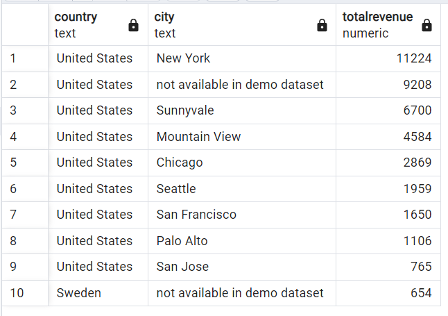
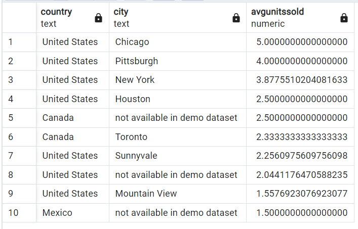
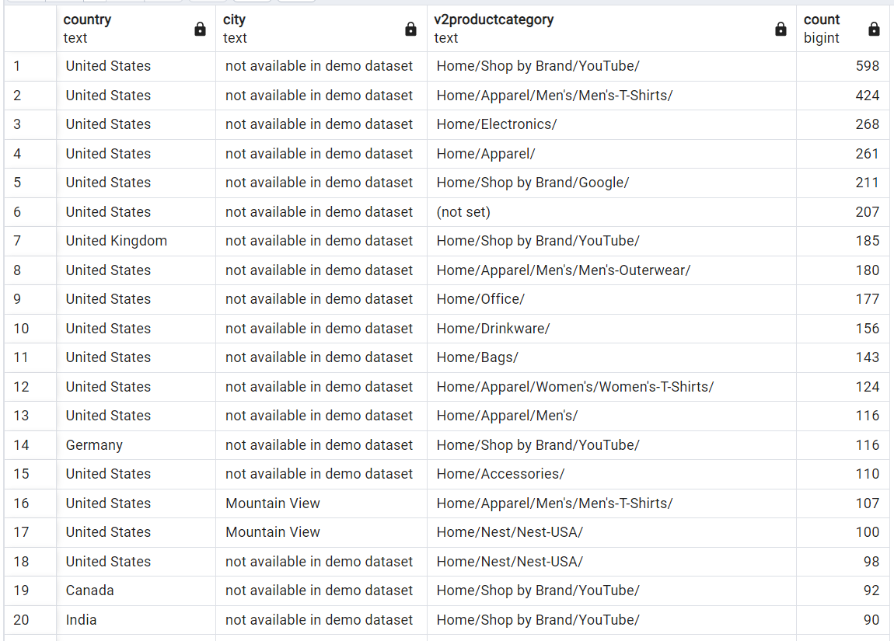
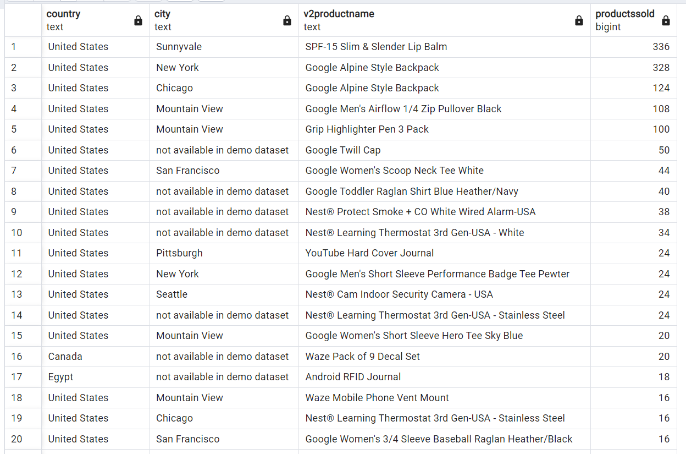
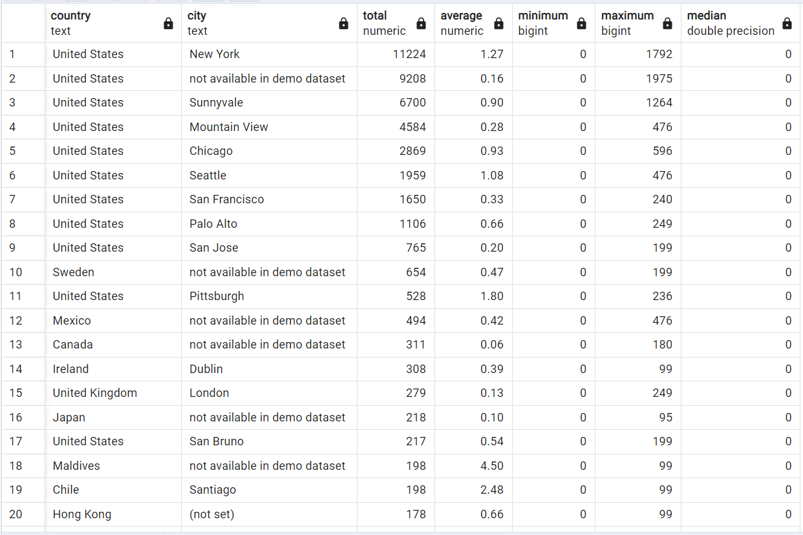

Answer the following questions and provide the SQL queries used to find the answer.

    
**Question 1: Which cities and countries have the highest level of transaction revenues on the site?**


SQL Queries:
```SQL
-- Displaying the total revenue for each country/city pair
SELECT s.country, s.city, 
	   SUM(a.revenue2) AS totalrevenue
FROM sessions_clean2 s
INNER JOIN analytics_clean3 a
	ON s.visitid = a.visitid
GROUP BY s.country, s.city
-- Ordered by descending to show the country/city pairs with the highest level of transaction revenues on site
ORDER BY totalrevenue DESC
LIMIT 10;
```

Answer:
The top 10 cities and countries that have the highest level of transaction revenues on the site are:



**Question 2: What is the average number of products ordered from visitors in each city and country?**


SQL Queries:
```SQL
-- Displaying the average number of products ordered by country/city
SELECT s.country, s.city, 
	   AVG(unitssold) AS avgunitssold
FROM sessions_clean2 s
INNER JOIN analytics_clean a
	ON s.visitid = a.visitid
WHERE unitssold != 0
GROUP BY s.country, s.city
-- Ordered by highest average to lowest average
ORDER BY avgunitssold DESC
LIMIT 10;
```


Answer:
The average number of products ordered from visitors in the top 10 cities and countries (excluding visits where zero orders were made) is:



**Question 3: Is there any pattern in the types (product categories) of products ordered from visitors in each city and country?**


SQL Queries:
``` SQL
-- Displaying the country/city pair and the top selling product category for each
SELECT country, city, v2productcategory, COUNT(*)
FROM sessions_clean2
GROUP BY country, city, v2productcategory
ORDER BY COUNT(*) DESC;
```


Answer:
There does appear to be a pattern in the types of products ordered from visitors of each city and country. Looking at the first 20 output rows, the top category for most countries appears to be Home/Shop by Brand/YouTube. This is true at least for the USA, UK, Germany, Canada, and India.



**Question 4: What is the top-selling product from each city/country? Can we find any pattern worthy of noting in the products sold?**


SQL Queries:
```SQL
-- Displaying the top-selling product form each country/city
SELECT country, city, v2productname,
	   SUM(unitssold) AS productssold
FROM sessions_clean2
INNER JOIN analytics_clean
USING (visitid)
GROUP BY country, city, v2productname
ORDER BY productssold DESC;
```

Answer:
Below are the top-selling products from the first 20 of the cities/countries. We can see that Google and Nest products are the top sellers for the site. The top selling products (for the most part) appear to be apparel items and home safety/security systems.



**Question 5: Can we summarize the impact of revenue generated from each city/country?**

SQL Queries:
```SQL
-- Displays descriptive statistics summary for each country/city
SELECT s.country, 
	   s.city,
	   SUM(a.revenue2) AS total,
	   ROUND(AVG(a.revenue2), 2) AS average,
	   MIN(a.revenue2) AS minimum,
	   MAX(a.revenue2) AS maximum,
	   PERCENTILE_CONT(0.5) WITHIN GROUP(ORDER BY a.revenue2) AS median
FROM sessions_clean2 s
INNER JOIN analytics_clean3 a
	ON s.visitid = a.visitid
GROUP BY s.country, s.city
ORDER BY total DESC;
```


Answer:
Here we can see the summary statistics for the impact of revenue generated from the first 20 city/country sets.



